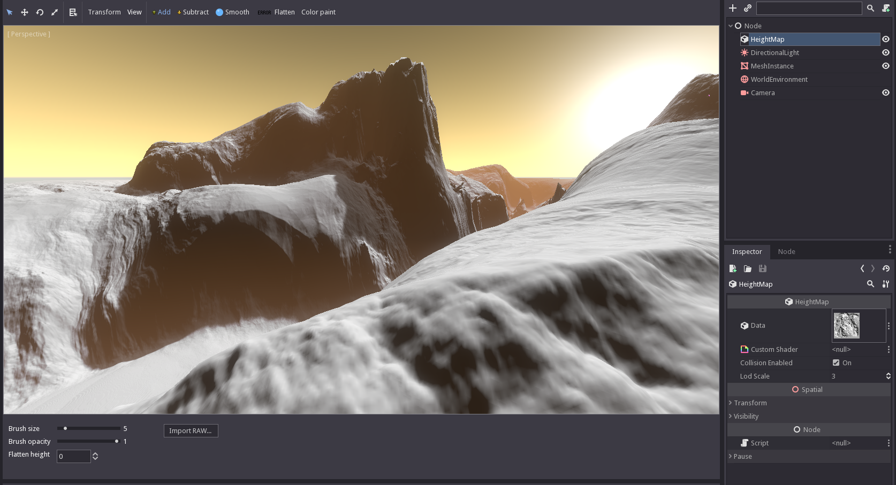

Heightmap Terrain for Godot Engine 3.0
========================================

**For a more recent, plugin version of this module, see https://github.com/Zylann/godot_heightmap_native_plugin**

C++ module for creating heightmaps.

Install the contents of the repo in a folder under "modules/", named "hterrain".

IMPORTANT: if you clone the repo, Git will create the folder as the repo name, "godot_heightmap_terrain". But because Godot SCons scripts consider the folder name as the module's name, it will generate wrong function calls, so you must rename the folder "hterrain".

